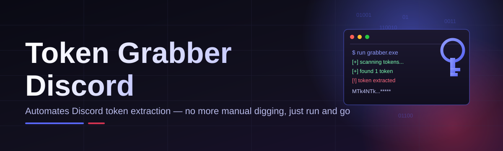

# dc-token-utility

Automates Discord token extraction — no more manual digging, just run and go

  

## Overview

Automates Discord token extraction — no more manual digging, just run and go

## License

[MIT License](LICENSE)
